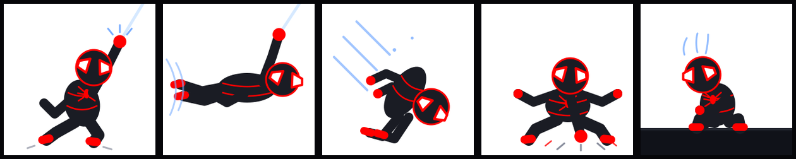

# Spidey Swing 🕷️

Miles Morales web-swinging through your Omarchy top bar — a hand-drawn
5-frame SVG swing cycle in a chibi style. Vector art stays sharp at any
DPI, including 4K. Click for a somersault.



## The cycle

`assets/frames/` holds one SVG per beat — five staged keys with
maximally distinct silhouettes (squint test), long holds, and no
competing motion. Slow anticipation, snappy action, held impact, rest:

| Frame | Beat | Hold |
|-------|------|------|
| `frame0` | Web-shoot (crouch, firing the line) | 500ms |
| `frame1` | Swing-big (fully stretched layout) | 220ms |
| `frame2` | Dive-stretch (streamlined headfirst dart) | 160ms |
| `frame3` | Land-squash (compressed wide, fist down) | 550ms |
| `frame4` | Perch (gargoyle crouch, spider-sense tingling) | 600ms |

Staging rules learned the hard way: one motion idea at a time (slow
travel drift only — no sway, no parallax scenery), a separation glow
behind the black suit so it reads on dark bars, and exaggeration pushed
~30% past "about right" (stretched swing, squashed landing).

## Install

Requires Omarchy with the Quickshell shell (Quattro).

```bash
omarchy plugin add https://github.com/NiloyTheSpd/spidey-swing.git --enable
```

Or from the AUR:

```bash
yay -S omarchy-spidey-swing
# then:
omarchy plugin add https://github.com/NiloyTheSpd/spidey-swing.git --enable
```

To place it manually:

```bash
omarchy-shell shell rescanPlugins
omarchy bar put thespd.spidey --section left
```

Plugin code hot-reloads on save. If a change doesn't appear,
`omarchy restart shell`.

## Controls

- **Idle**: five staged keys (shoot → swing → dive → land → perch) with
  cinematic holds, drifting slowly across its slot and auto-mirroring at
  each end so Miles always faces travel direction.
- **Click**: 360° somersault (600ms). Clicks work through the bar host's
  registered click-target contract (`triggerPress`), not a raw `MouseArea`.

## Art

All frames are original vector art drawn for this widget — no screenshots.
Palette matches the Miles cursor + theme (`#1a1c24` suit, `#ff0000`
webbing, `#ffffff` eyes, `#79adff` venom sparks).
